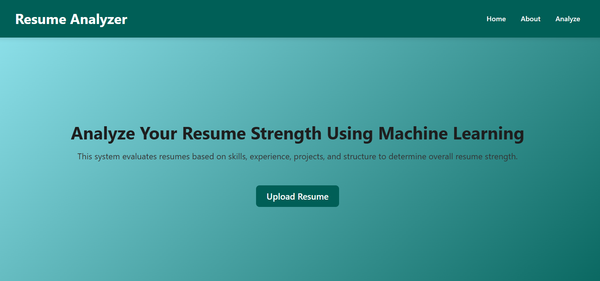
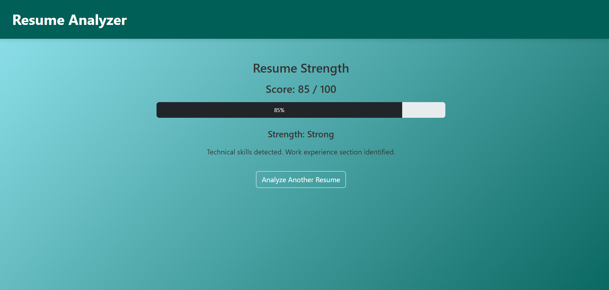

# Resume Strength Analyzer 📄🚀

An end-to-end Machine Learning web application that evaluates resume strength using Natural Language Processing (NLP) and classification models.

## 🌟 Project Overview
This project predicts the strength of a resume (**Strong**, **Average**, or **Weak**) based on its textual content. The system automates the evaluation process to provide objective feedback for job seekers and recruiters.

**The system performs:**
*   **Extraction:** Resume text extraction from PDF files.
*   **Preprocessing:** Advanced text cleaning and tokenization.
*   **Vectorization:** Feature extraction using **TF-IDF**.
*   **Classification:** Predictive modeling using **Support Vector Machines (SVM)**.
*   **Explainability:** Hybrid rule-based explanation generation.
*   **Visualization:** Dynamic scoring with a real-time visual progress bar.
*   **Deployment:** Fully functional web interface built with **Flask**.

## ⚖️ Problem Statement
Resume evaluation is often subjective and time-consuming. This project builds a proof-of-concept ML system that classifies resumes based on textual quality indicators, removing human bias from the initial screening phase.

## 📊 Dataset & Model Selection
## 📊 Dataset
The model was trained on a synthetic resume dataset sourced from Kaggle (AI-Powered Resume Screening Dataset).

*   **Content:** 1,000+ synthetic resume profiles.
*   **Key Features:** AI Score, Experience Level, Projects Count, and Skill Diversity.
*   **Target:** Used to engineer strength labels (Strong, Average, Weak) for classification.

*   **Challenge:** Significant class imbalance was observed (majority "Strong" resumes).

### Model Evaluation
We tested multiple architectures to find the best fit for imbalanced textual data:
1.  **Logistic Regression** (Baseline)
2.  **Linear Models**
3.  **Support Vector Machine (SVM)** — *Selected Model*

**Why SVM?**
SVM was chosen for its superior ability to handle high-dimensional text data and its effectiveness in predicting minority classes (Weak, Average) compared to simpler linear models.
*   **Final Accuracy:** ~60% (Impacted by synthetic data constraints and class imbalance).

## 🛠️ Tech Stack
*   **Backend:** [Python](https://www.python.org), [Flask](https://flask.palletsprojects.com)
*   **Machine Learning:** [scikit-learn](https://scikit-learn.org), [NumPy](https://numpy.org), [Pandas](https://pandas.pydata.org)
*   **NLP:** [TF-IDF Vectorization](https://scikit-learn.orgstable/modules/generated/sklearn.feature_extraction.text.TfidfVectorizer.html)
*   **Frontend:** [HTML5](https://developer.mozilla.org), [Bootstrap 5](https://getbootstrap.com), [CSS3](https://developer.mozilla.org)

## ✨ Key Features
*   **Intelligent Prediction:** Instant classification into Strength tiers.
*   **Numeric Scoring:** Calculated score mapped directly to prediction bands.
*   **Interactive UI:** Clean, multi-page interface featuring a centered black progress bar.
*   **Feedback System:** Keyword-based explanations highlighting why a resume received its score.

## 📸 Screenshots
| Home Page | Results Dashboard |
|---|---|
|  |  |

## How to Run the Project

1. Install dependencies:
   pip install -r requirements.txt

2. Train the model:
   Run the notebook in `/notebooks` to generate:
   - resume_model.pkl
   - vectorizer.pkl

3. Start the Flask app:
   python app.py
   
## ⚠️ Project Limitations
*   **Synthetic Data:** The model is trained on a synthetic dataset which may lack real-world nuances.
*   **Generalization:** Limited performance on highly creative or non-standard resume formats.
*   **Class Imbalance:** Higher precision for "Strong" resumes than "Weak" ones.

## 🚀 Future Improvements
*   [ ] Integrate real-world labeled resume datasets.
*   [ ] Implement Deep Learning models like **BERT** or **RoBERTa** for better context understanding.
*   [ ] Refine scoring logic to include layout and formatting analysis.
*   [ ] Enhance the UI with dark mode support.

---
*Developed as a Machine Learning Proof of Concept.*
